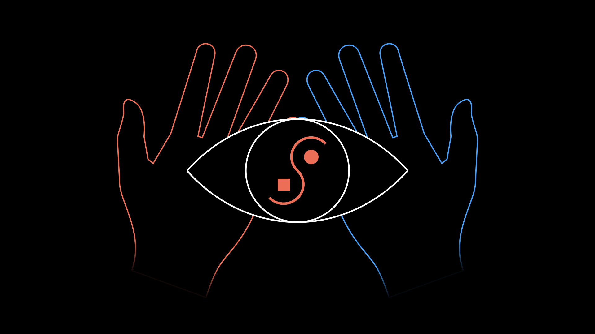

# HandTalk

# Goal
Add hand tracking capacity to DreamTalk using the Leap Motion controller

# Notes
use Unity with FBXRecorder to record data and later import to c4d for Dream Talk creation

# Links
https://www.reddit.com/r/leapmotion/comments/leu2ku/how_can_i_in_2021_record_leap_motion_data_into_a/
